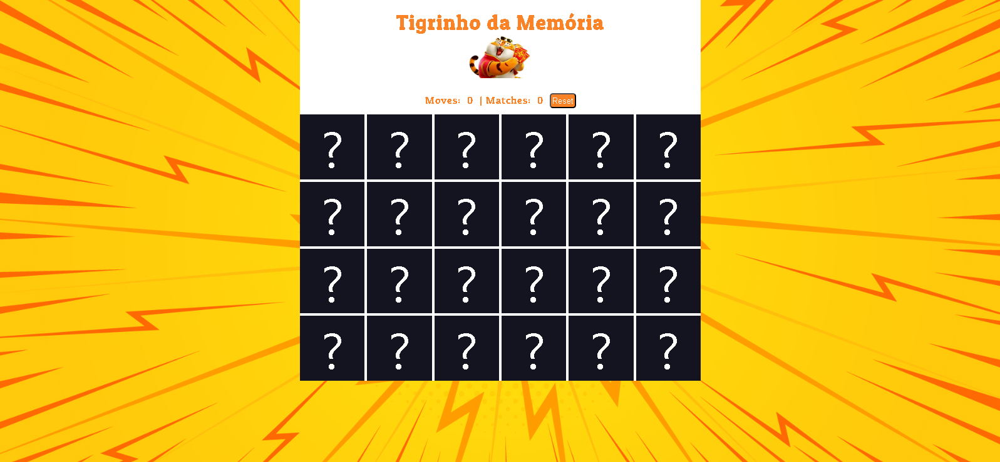

<h1 align="center">

 Jogo da Memória do tigrinho.🐯

</h1>

## 📖 Sobre o projeto

Este é o "Jogo da Memória - Tigrinho da Memória", uma implementação divertida e desafiadora do clássico jogo da memória desenvolvida com React e estilizada com CSS puro. O jogo é um ótimo exercício mental que desafia sua memória e habilidades de correspondência.

## Como Jogar

O objetivo do jogo é encontrar todos os pares de cartas correspondentes. Para jogar:

1. Clique em duas cartas para revelar seus conteúdos.
2. Se as cartas forem correspondentes, elas permanecerão viradas para cima.
3. Se as cartas não corresponderem, elas serão viradas para baixo novamente.
4. Continue encontrando pares até encontrar todos.

O jogo registra o número de movimentos que você faz e o número de correspondências que você encontrou. Desafie a si mesmo a terminar o jogo com o menor número de movimentos possíveis.

## 💻 Tecnologias

Este projeto foi desenvolvido com as seguintes tecnologias:

- React: A biblioteca JavaScript para criar interfaces de usuário interativas.
- CSS puro: Para estilização e layout personalizados.
- HTML: Para a estrutura do jogo e elementos da interface do usuário.
- Vitejs: Para o desenvolvimento rápido e otimizado.

## Como Iniciar

Para jogar o "Jogo da Memória - Tigrinho da Memória", siga estas etapas:

1. Clone o repositório ou faça o download dos arquivos.
2. Abra o terminal e navegue até o diretório do projeto.
3. Execute `npm install` para instalar as dependências.
4. Execute `npm start` para iniciar o servidor de desenvolvimento.
5. Acesse o jogo no seu navegador em o link que vai lher ser oferecido.

## Autor

Ricardo Malta - Ricardomaltamarta@gmail.com

